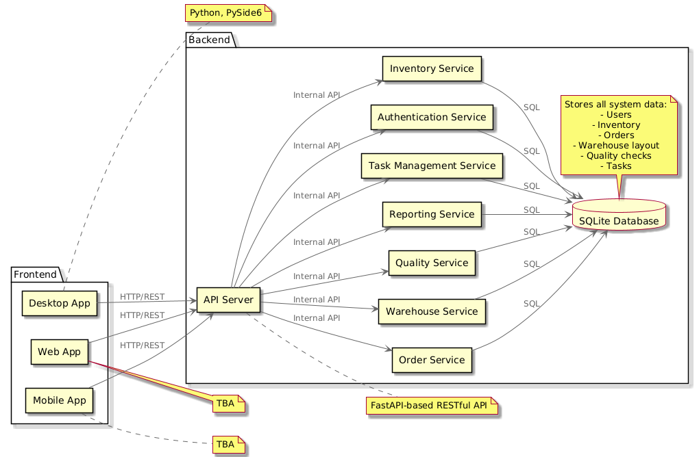
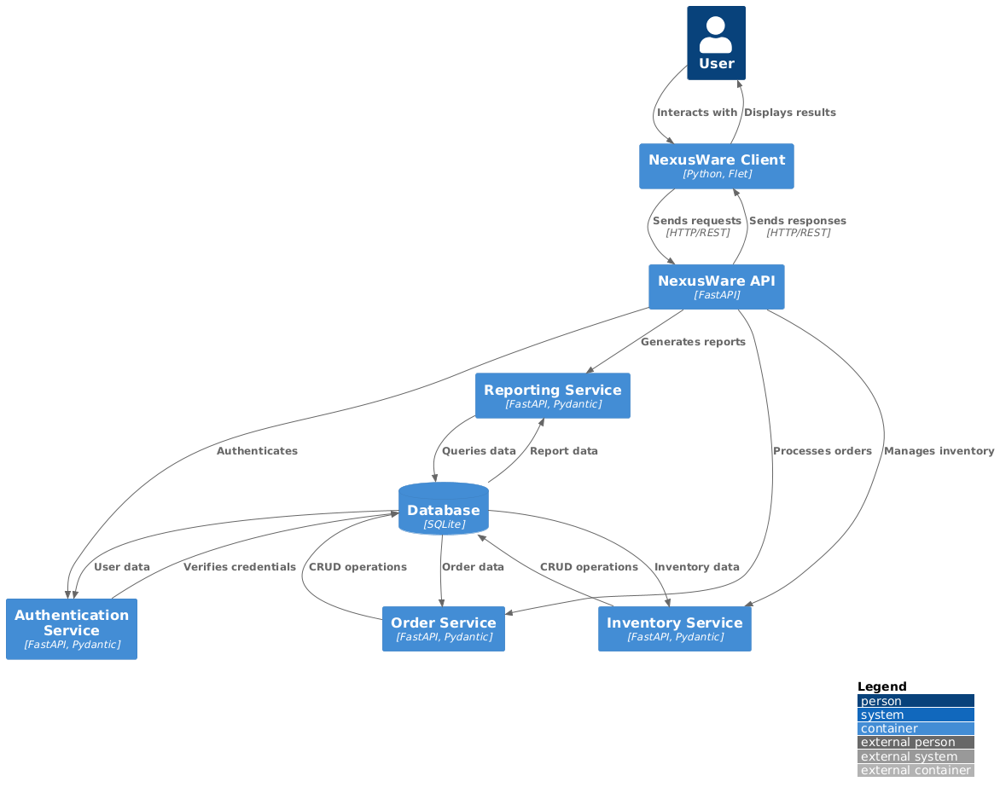
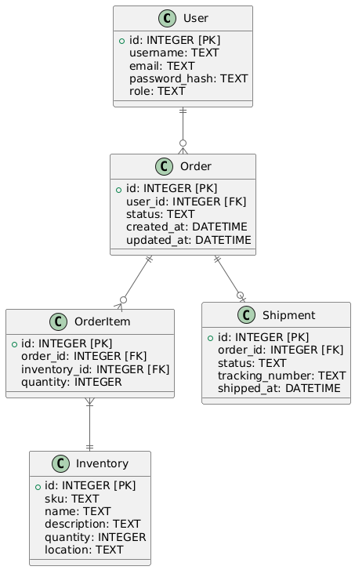

# NexusWare Architecture

This document provides an overview of the NexusWare Warehouse Management System architecture, including component diagrams, data flow, and key design decisions.

## Table of Contents

1. [System Overview](#system-overview)
2. [Component Diagram](#component-diagram)
3. [Data Flow Diagram](#data-flow-diagram)
4. [Database Schema](#database-schema)
5. [API Design](#api-design)
6. [Security Considerations](#security-considerations)

## System Overview

NexusWare is a distributed system consisting of a central server and multiple client applications (mobile, web, and desktop). The system is designed to be scalable, maintainable, and secure.

## Component Diagram

The following diagram illustrates the high-level components of the NexusWare system:

## Data Flow Diagram

The following diagram illustrates the data flow within the NexusWare system:

## Database Schema

The following diagram illustrates the core database schema for NexusWare:

## API Design

The NexusWare API follows RESTful principles and is organized into the following main resources:

### Assets
- `POST /assets/`: Create a new asset
- `GET /assets/`: Retrieve a list of assets
- `GET /assets/{asset_id}`: Retrieve a specific asset
- `PUT /assets/{asset_id}`: Update an asset
- `DELETE /assets/{asset_id}`: Delete an asset
- `GET /assets/types`: Get all asset types
- `GET /assets/statuses`: Get all asset statuses
- `POST /assets/maintenance`: Create a new maintenance record
- `GET /assets/maintenance`: Retrieve maintenance records
- `GET /assets/maintenance/{maintenance_id}`: Retrieve a specific maintenance record
- `PUT /assets/maintenance/{maintenance_id}`: Update a maintenance record
- `DELETE /assets/maintenance/{maintenance_id}`: Delete a maintenance record
- `GET /assets/maintenance/types`: Get all maintenance types
- `GET /assets/{asset_id}/maintenance-history`: Get maintenance history for an asset
- `POST /assets/{asset_id}/schedule-maintenance`: Schedule maintenance for an asset
- `PUT /assets/maintenance/{maintenance_id}/complete`: Complete a maintenance task

### Audit
- `POST /audit/logs`: Create a new audit log
- `GET /audit/logs`: Retrieve audit logs
- `GET /audit/logs/{log_id}`: Retrieve a specific audit log
- `GET /audit/logs/summary`: Get audit summary
- `GET /audit/logs/user/{user_id}`: Get audit logs for a specific user
- `GET /audit/logs/table/{table_name}`: Get audit logs for a specific table
- `GET /audit/logs/record/{table_name}/{record_id}`: Get audit logs for a specific record
- `GET /audit/logs/export`: Export audit logs
- `GET /audit/logs/actions`: Get all audit log actions
- `GET /audit/logs/tables`: Get all audited tables

### Inventory
- `POST /inventory/products`: Create a new product
- `GET /inventory/products`: Retrieve products
- `GET /inventory/products/{product_id}`: Retrieve a specific product
- `PUT /inventory/products/{product_id}`: Update a product
- `DELETE /inventory/products/{product_id}`: Delete a product
- `POST /inventory/products/barcode`: Get product by barcode
- `POST /inventory/categories`: Create a new product category
- `GET /inventory/categories`: Retrieve product categories
- `GET /inventory/categories/{category_id}`: Retrieve a specific product category
- `PUT /inventory/categories/{category_id}`: Update a product category
- `DELETE /inventory/categories/{category_id}`: Delete a product category
- `POST /inventory/inventory`: Create a new inventory record
- `GET /inventory/inventory`: Retrieve inventory records
- `GET /inventory/inventory/{inventory_id}`: Retrieve a specific inventory record
- `PUT /inventory/inventory/{inventory_id}`: Update an inventory record
- `POST /inventory/inventory/{inventory_id}/adjust`: Adjust inventory quantity
- `POST /inventory/inventory/transfer`: Transfer inventory between locations
- `POST /inventory/locations`: Create a new location
- `GET /inventory/locations`: Retrieve locations
- `GET /inventory/locations/{location_id}`: Retrieve a specific location
- `PUT /inventory/locations/{location_id}`: Update a location
- `DELETE /inventory/locations/{location_id}`: Delete a location
- `POST /inventory/zones`: Create a new zone
- `GET /inventory/zones`: Retrieve zones
- `GET /inventory/zones/{zone_id}`: Retrieve a specific zone
- `PUT /inventory/zones/{zone_id}`: Update a zone
- `DELETE /inventory/zones/{zone_id}`: Delete a zone
- `GET /inventory/report`: Get inventory report
- `GET /inventory/warehouse/layout`: Get warehouse layout
- `POST /inventory/cycle-count`: Perform cycle count
- `GET /inventory/low-stock`: Get low stock items
- `GET /inventory/out-of-stock`: Get out of stock items
- `POST /inventory/reorder`: Create reorder list
- `GET /inventory/product-locations/{product_id}`: Get locations for a product
- `POST /inventory/batch-update`: Batch update inventory
- `GET /inventory/movement-history/{product_id}`: Get inventory movement history
- `POST /inventory/stocktake`: Perform stocktake
- `GET /inventory/abc-analysis`: Perform ABC analysis
- `POST /inventory/optimize-locations`: Optimize inventory locations

### Orders
- `POST /orders/orders`: Create a new order
- `GET /orders/orders`: Retrieve orders
- `GET /orders/orders/{order_id}`: Retrieve a specific order
- `PUT /orders/orders/{order_id}`: Update an order
- `DELETE /orders/orders/{order_id}`: Delete an order
- `GET /orders/orders/summary`: Get order summary
- `POST /orders/customers`: Create a new customer
- `GET /orders/customers`: Retrieve customers
- `GET /orders/customers/{customer_id}`: Retrieve a specific customer
- `PUT /orders/customers/{customer_id}`: Update a customer
- `DELETE /orders/customers/{customer_id}`: Delete a customer
- `POST /orders/purchase-orders`: Create a new purchase order
- `GET /orders/purchase-orders`: Retrieve purchase orders
- `GET /orders/purchase-orders/{po_id}`: Retrieve a specific purchase order
- `PUT /orders/purchase-orders/{po_id}`: Update a purchase order
- `DELETE /orders/purchase-orders/{po_id}`: Delete a purchase order
- `POST /orders/suppliers`: Create a new supplier
- `GET /orders/suppliers`: Retrieve suppliers
- `GET /orders/suppliers/{supplier_id}`: Retrieve a specific supplier
- `PUT /orders/suppliers/{supplier_id}`: Update a supplier
- `DELETE /orders/suppliers/{supplier_id}`: Delete a supplier
- `POST /orders/orders/{order_id}/cancel`: Cancel an order
- `POST /orders/orders/{order_id}/ship`: Ship an order
- `GET /orders/customers/{customer_id}/orders`: Get orders for a customer
- `POST /orders/purchase-orders/{po_id}/receive`: Receive a purchase order
- `GET /orders/suppliers/{supplier_id}/purchase-orders`: Get purchase orders for a supplier
- `GET /orders/po-items/{po_item_id}`: Retrieve a specific PO item
- `PUT /orders/po-items/{po_item_id}`: Update a PO item
- `GET /orders/po-items`: Retrieve PO items
- `GET /orders/po-items/by-product/{product_id}`: Get PO items for a product
- `GET /orders/po-items/pending-receipt`: Get pending receipt PO items

### Quality
- `POST /quality/checks`: Create a new quality check
- `GET /quality/checks`: Retrieve quality checks
- `GET /quality/checks/{check_id}`: Retrieve a specific quality check
- `PUT /quality/checks/{check_id}`: Update a quality check
- `DELETE /quality/checks/{check_id}`: Delete a quality check
- `GET /quality/metrics`: Get quality metrics
- `POST /quality/standards`: Create a new quality standard
- `GET /quality/standards`: Retrieve quality standards
- `GET /quality/standards/{standard_id}`: Retrieve a specific quality standard
- `PUT /quality/standards/{standard_id}`: Update a quality standard
- `DELETE /quality/standards/{standard_id}`: Delete a quality standard
- `POST /quality/alerts`: Create a new quality alert
- `GET /quality/alerts`: Retrieve quality alerts
- `PUT /quality/alerts/{alert_id}/resolve`: Resolve a quality alert
- `GET /quality/product/{product_id}/history`: Get quality history for a product
- `GET /quality/checks/summary`: Get quality check summary
- `GET /quality/product/{product_id}/standards`: Get quality standards for a product
- `POST /quality/batch-check`: Create batch quality checks
- `GET /quality/alerts/active`: Get active quality alerts
- `POST /quality/checks/{check_id}/comment`: Add a comment to a quality check
- `GET /quality/reports/defect-rate`: Get product defect rates

### Reports
- `GET /reports/inventory-summary`: Get inventory summary report
- `GET /reports/order-summary`: Get order summary report
- `GET /reports/warehouse-performance`: Get warehouse performance report
- `GET /reports/kpi-dashboard`: Get KPI dashboard

### Search
- `GET /search/products`: Search products
- `GET /search/orders`: Search orders

### Tasks
- `POST /tasks/tasks`: Create a new task
- `GET /tasks/tasks`: Retrieve tasks
- `GET /tasks/tasks/{task_id}`: Retrieve a specific task
- `PUT /tasks/tasks/{task_id}`: Update a task
- `DELETE /tasks/tasks/{task_id}`: Delete a task
- `POST /tasks/tasks/{task_id}/complete`: Complete a task
- `POST /tasks/tasks/{task_id}/comment`: Add a comment to a task
- `GET /tasks/tasks/{task_id}/comments`: Get comments for a task
- `GET /tasks/tasks/statistics`: Get task statistics
- `GET /tasks/tasks/user-summary`: Get user task summary
- `GET /tasks/tasks/overdue`: Get overdue tasks
- `POST /tasks/tasks/batch-create`: Create batch tasks
- `GET /tasks/tasks/my-tasks`: Get tasks for the current user

### Users
- `POST /users/login`: User login
- `POST /users/register`: User registration
- `GET /users/me`: Get current user
- `PUT /users/me`: Update current user
- `GET /users/`: Get all users
- `POST /users/`: Create a new user
- `GET /users/{user_id}`: Get a specific user
- `PUT /users/{user_id}`: Update a user
- `DELETE /users/{user_id}`: Delete a user
- `POST /users/roles`: Create a new role
- `GET /users/roles`: Get all roles
- `GET /users/roles/{role_id}`: Get a specific role
- `PUT /users/roles/{role_id}`: Update a role
- `DELETE /users/roles/{role_id}`: Delete a role
- `POST /users/permissions`: Create a new permission
- `GET /users/permissions`: Get all permissions
- `GET /users/permissions/{permission_id}`: Get a specific permission
- `PUT /users/permissions/{permission_id}`: Update a permission
- `DELETE /users/permissions/{permission_id}`: Delete a permission

### Warehouse
- `POST /warehouse/pick-lists`: Create a new pick list
- `GET /warehouse/pick-lists`: Retrieve pick lists
- `GET /warehouse/pick-lists/{pick_list_id}`: Retrieve a specific pick list
- `PUT /warehouse/pick-lists/{pick_list_id}`: Update a pick list
- `DELETE /warehouse/pick-lists/{pick_list_id}`: Delete a pick list
- `POST /warehouse/receipts`: Create a new receipt
- `GET /warehouse/receipts`: Retrieve receipts
- `GET /warehouse/receipts/{receipt_id}`: Retrieve a specific receipt
- `PUT /warehouse/receipts/{receipt_id}`: Update a receipt
- `DELETE /warehouse/receipts/{receipt_id}`: Delete a receipt
- `POST /warehouse/shipments`: Create a new shipment
- `GET /warehouse/shipments`: Retrieve shipments
- `GET /warehouse/shipments/{shipment_id}`: Retrieve a specific shipment
- `PUT /warehouse/shipments/{shipment_id}`: Update a shipment
- `DELETE /warehouse/shipments/{shipment_id}`: Delete a shipment
- `POST /warehouse/carriers`: Create a new carrier
- `GET /warehouse/carriers`: Retrieve carriers
- `GET /warehouse/carriers/{carrier_id}`: Retrieve a specific carrier
- `PUT /warehouse/carriers/{carrier_id}`: Update a carrier
- `DELETE /warehouse/carriers/{carrier_id}`: Delete a carrier
- `GET /warehouse/stats`: Get warehouse stats
- `GET /warehouse/inventory/{location_id}`: Get inventory for a location
- `PUT /warehouse/inventory/{location_id}/{product_id}`: Update inventory for a location and product
- `POST /warehouse/inventory/move`: Move inventory
- `POST /warehouse/inventory/adjust`: Adjust inventory

### Yard
- `POST /yard/locations`: Create a new yard location
- `GET /yard/locations`: Retrieve yard locations
- `GET /yard/locations/{location_id}`: Retrieve a specific yard location
- `PUT /yard/locations/{location_id}`: Update a yard location
- `DELETE /yard/locations/{location_id}`: Delete a yard location
- `POST /yard/appointments`: Create a new dock appointment
- `GET /yard/appointments`: Retrieve dock appointments
- `GET /yard/appointments/{appointment_id}`: Retrieve a specific dock appointment
- `PUT /yard/appointments/{appointment_id}`: Update a dock appointment
- `DELETE /yard/appointments/{appointment_id}`: Delete a dock appointment
- `GET /yard/stats`: Get yard stats
- `GET /yard/utilization`: Get yard utilization report
- `GET /yard/carrier-performance`: Get carrier performance report
- `POST /yard/check-availability`: Check appointment availability

## Security Considerations

1. Authentication: JWT-based authentication is used to secure API endpoints.
2. Authorization: Role-based access control (RBAC) is implemented to restrict access to sensitive operations.
3. Data Encryption: All communication between clients and the server is encrypted using HTTPS.
4. Input Validation: Strict input validation is performed on both client and server-side to prevent injection attacks.
5. Rate Limiting: API rate limiting is implemented to prevent abuse and ensure fair usage.
6. Audit Logging: All critical operations are logged for auditing and compliance purposes.

> For more detailed information on each component and implementation guidelines, please refer to the respective documentation in the `docs/` directory.