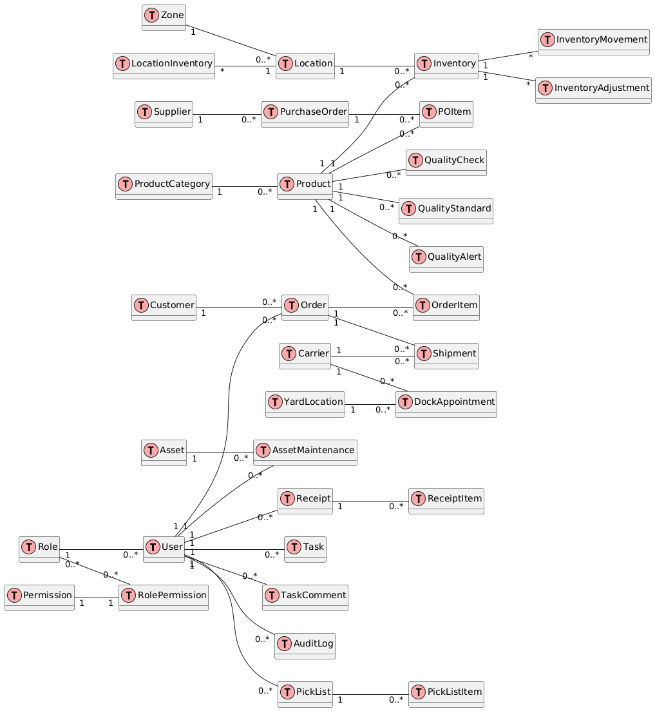

# NexusWare Architecture

This document provides an overview of the NexusWare Warehouse Management System architecture, including component diagrams, data flow, and key design decisions.

## Table of Contents

1. [System Overview](#system-overview)
2. [Component Diagram](#component-diagram)
3. [Data Flow Diagram](#data-flow-diagram)
4. [Database Schema](#database-schema)
5. [API Design](#api-design)
6. [Security Considerations](#security-considerations)

## System Overview

NexusWare is a distributed system consisting of a central server and multiple client applications (mobile, web, and desktop). The system is designed to be scalable, maintainable, and secure.

## Component Diagram

The following diagram illustrates the high-level components of the NexusWare system:

## Data Flow Diagram
The following diagram illustrates the data flow within the NexusWare system:

## Database Schema
The following diagram illustrates the core database schema for NexusWare:

## API Design
The NexusWare API follows RESTful principles and is organized into the following main resources:

* `/auth`: Authentication and user management
* `/inventory`: Inventory management
* `/orders`: Order processing and management
* `/shipments`: Shipment tracking and management
* `/reports`: Reporting and analytics

Each resource supports standard CRUD operations where applicable, using appropriate HTTP methods (GET, POST, PUT, DELETE).

## Security Considerations

1. Authentication: JWT-based authentication is used to secure API endpoints.
2. Authorization: Role-based access control (RBAC) is implemented to restrict access to sensitive operations.
3. Data Encryption: All communication between clients and the server is encrypted using HTTPS.
4. Input Validation: Strict input validation is performed on both client and server-side to prevent injection attacks.
5. Rate Limiting: API rate limiting is implemented to prevent abuse and ensure fair usage.
6. Audit Logging: All critical operations are logged for auditing and compliance purposes.

> For more detailed information on each component and implementation guidelines, please refer to the respective documentation in the `docs/` directory.

