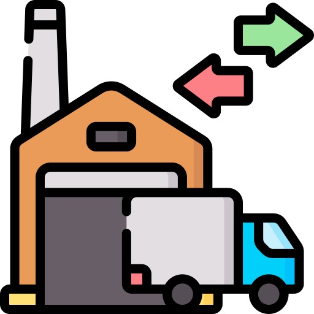

  

  <b>NexusWare</b>

  Advanced Warehouse Management System

NexusWare is a cutting-edge, multi-platform Warehouse Management System designed to revolutionize inventory control,
order fulfillment, and warehouse operations. Built with Python and SQLite, NexusWare offers seamless integration
across mobile, web, and desktop environments.

> Although initial development idea was to use Flet lib, it was decided to split the project into separate projects
> for each platform.

## Feature Roadmap

| Feature                     | Mobile | Web | Desktop |
|-----------------------------|--------|-----|---------|
| User Authentication         | ✅      | ✅   | ✅       |
| Inventory Management        | ✅      | ✅   | ✅       |
| Barcode/QR Scanning         | ✅      | -   | -       |
| Picking and Packing         | ✅      | ✅   | ✅       |
| Receiving                   | ✅      | ✅   | ✅       |
| Shipping                    | ✅      | ✅   | ✅       |
| Cycle Counting              | ✅      | ✅   | ✅       |
| Asset Tracking              | ✅      | ✅   | ✅       |
| Task Management             | ✅      | ✅   | ✅       |
| Real-time Communication     | ✅      | ✅   | ✅       |
| Offline Mode                | ✅      | -   | ✅       |
| Voice Control               | ✅      | -   | -       |
| Augmented Reality           | ✅      | -   | -       |
| Dashboard & Analytics       | -      | ✅   | ✅       |
| Order Management            | -      | ✅   | ✅       |
| Warehouse Layout            | -      | ✅   | ✅       |
| Labor Management            | -      | ✅   | ✅       |
| Supplier Management         | -      | ✅   | ✅       |
| Customer Management         | -      | ✅   | ✅       |
| Integration Hub             | -      | ✅   | ✅       |
| Document Management         | -      | ✅   | ✅       |
| Quality Control             | -      | ✅   | ✅       |
| Billing and Invoicing       | -      | ✅   | ✅       |
| Yard Management             | -      | ✅   | ✅       |
| System Administration       | -      | ✅   | ✅       |
| Offline Database Management | -      | -   | ✅       |
| Advanced Reporting          | -      | -   | ✅       |
| Inventory Planning          | -      | -   | ✅       |
| 3D Warehouse Visualization  | -      | -   | ✅       |
| Batch Processing            | -      | -   | ✅       |
| Barcode and Label Design    | -      | -   | ✅       |
| Advanced Search and Filter  | -      | ✅   | ✅       |
| System Diagnostics          | -      | -   | ✅       |
| Simulation and Modeling     | -      | -   | ✅       |
| Training Mode               | -      | -   | ✅       |
| Customization Tools         | -      | -   | ✅       |

## Architecture

For a detailed description of the system architecture, please refer to the [ARCHITECTURE.md](docs/ARCHITECTURE.md) file.

## Getting Started

(Instructions for setting up development environment, installing dependencies, and running the application will be added
here.)

## Contributing

We welcome contributions to NexusWare! Please refer to our [CONTRIBUTING.md](docs/CONTRIBUTING.md) file for guidelines
on how to report issues, submit pull requests, and more.

## License

This project is licensed under the MIT License - see the [LICENSE](LICENSE) file for details.
